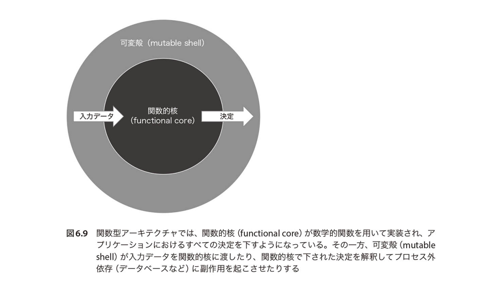

# 単体テストの3つの手法
## 出力値ベーステスト

### 出力値ベーステストとは？
戻り値を確認する

## 状態ベーステスト
### 状態ベーステストとは？
テスト対象の状態、協力者オブジェクトの状態、プロセス外依存の状態を確認する

> [!IMPORTANT] リファクタリングへの耐性
> テスト対象メソッドの実行によって、変更された状態を確認するため実装の詳細と結びつきやすい

## コミュニケーションベーステスト
### コミュニケーションベーステストとは？
テスト対象と協力者オブジェクトとのコミュニケーションを確認する
- e.g.) 協力者オブジェクトを正しく呼び出しているかなど

> [!WARNING] リファクタリングへの耐性
> スタブとのコミュニケーションを検証してはならない

 

# 保守について
## 出力値ベーステスト
構造がシンプルなため、保守性が高い
- 引数とその戻り値を検証するだけでよい

## 状態ベーステスト
保守性が低い
- オブジェクトの1つ1つの状態を検証する必要があり、複雑になりやすい

## コミュニケーションベーステスト
保守性が最も低い
- 関連する協力者オブジェクトのスタブやモックを用意する必要がある

## 関数型アーキテクチャの適用
### 何が嬉しい？
出力値ベーステストの数を最大化することができる

## 関数型アーキテクチャとは？
- 関数的核と可変核とに分離する
  - 関数的核
    - 入力値によって出力を返す（純粋関数）
    - 副作用を起こさない
    - 決定を下す
  - 可変核
    - 副作用を起こす
    - 関数的核で下された決定を実行する
    - 関数的核に渡す入力値を生成する

