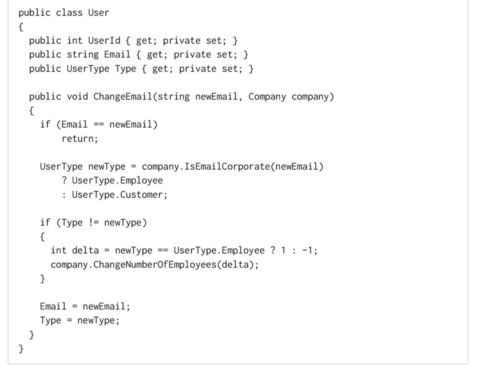
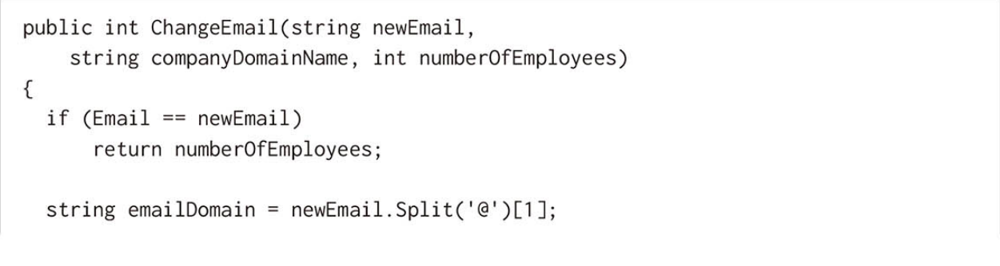
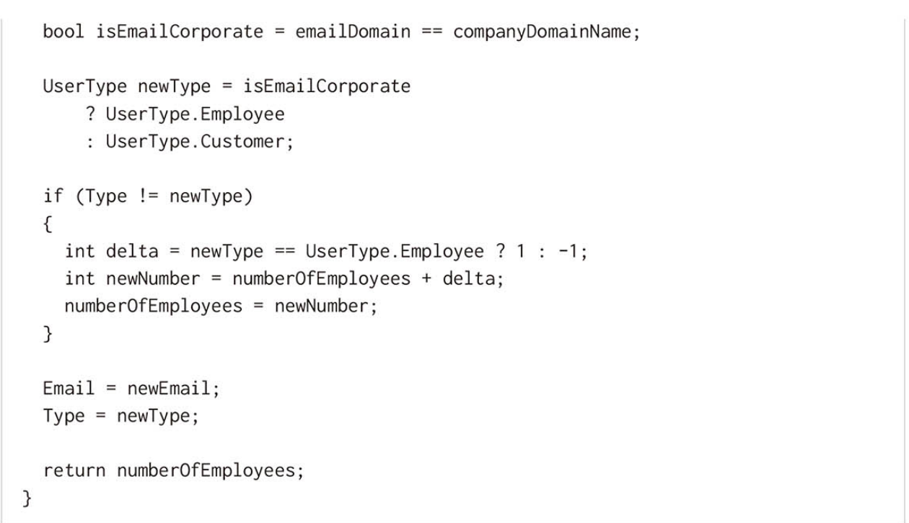

# 単体テストの価値を高めるリファクタリング
## 複雑なコードをテストしないことは非常にリスク

- コードがより重要に、より複雑になるにつれ協力者オブジェクトの数を減らさなくてはならない

### テストを難しくするものは?
依存してはいけないものに直接依存してしまうとき
- (e.g.) フレームワーク、プロセス外依存、UI

### 過度に複雑なコードを取り除くには?
依存してはいけないものを質素なオブジェクトでラップする
- 質素なオブジェクト(Humble Object)とは?
  - 複雑なロジックを持たない

### 質素なオブジェクト(Humble Object)としてのPresenterとController
MVC、MVPにおいてPresenterやControllerはUIとModel(ビジネスロジック)との連携を指揮する役割

## ヘキサゴナルアーキテクチャにおけるリファクタリング

### ドメインロジックにプロセス外依存の処理を記述しない
ドメインとプロセス外依存の連携はアプリケーション・サービス層(Controller)に記述する

### アプリケーション・サービス層は質素なオブジェクトにする
ドメインモデルの生成処理や変換処理など複雑なロジックをファクトリクラスなどに分離する

### ドメインモデルを単一責任になるように分離する
- 「尋ねるな、命じよ！」の原則を遵守する

#### リファクタ前

#### リファクタ後

