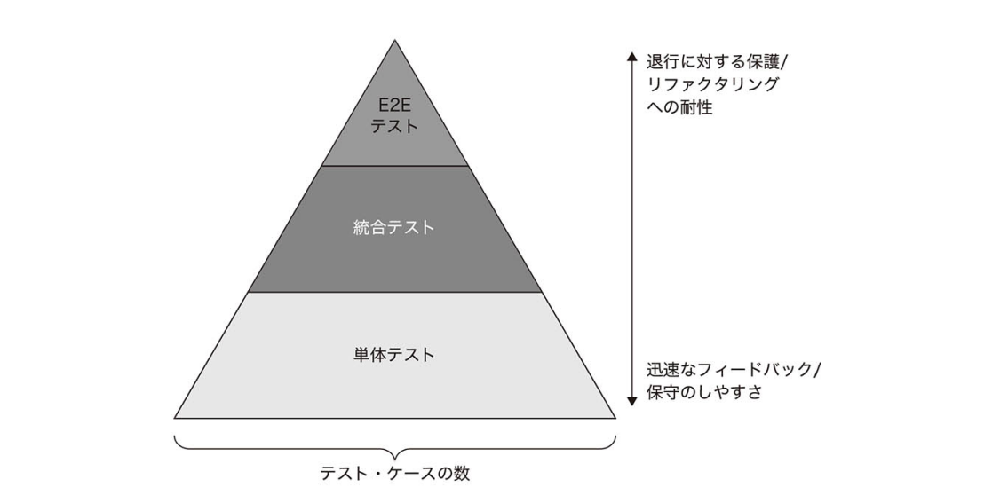

# なぜ統合テストを行うのか？

## 統合テストとは？

### 単体テスト以外のテスト
- 単体テストの性質
  - 1単位のふるまいを検証すること
  - 実行時間が短いこと
  - 他のテストケースから隔離されて実行されること

## 統合テストの目的
統合テストとは、プロセス外依存との観察可能な振る舞いをテストすることが目的である
外部システムの視点でテストするようなもの

## テストピラミッド

### 単体テストの役割
検証する内容のほとんどは単体テストに持たせる
- 可能な限りの異常ケースを検証する

### 統合テストの役割
- 1, 2件の包括的なhappy path
- 単体テストでは実施できない異常ケース

## プロセス外依存のmock化について

### 2種類のプロセス外依存
- 管理下にあるプロセス外依存
  - (e.g.) テスト対象システムでのみ使用されるデータベース
- 管理下にないプロセス外依存
  - (e.g.) 外部システム、メールサービス

### 管理下にあるプロセス外依存
*モックに置き換えるべき依存*

この依存は後方互換を維持する必要があり、テスト対象システムのリファクタリングによって外部システムとの仕様が壊れていないか確認できる

### 管理下にあるプロセス外依存
*モックに置き換えるべきではない依存*

この依存は外部システムにとって実装の詳細であるため、実際の依存をそのまま使用するほうが実際の結果に近くなりテストの品質が上がる。

> [!WARNING] 質の悪いテストケースを作成するなら、作成しないほうが良い。
管理下にあるプロセス外依存をそのまま使用することができない場合、その統合テストに価値は無いため作成せず単体テストにとどめる方が良いことになる。

## インターフェースの使い所
### インターフェースの目的
#### 抽象化
**複数**の実装クラスの振る舞いを抽象化

### インターフェースにすべき依存
管理下にないプロセス外依存
テスト時にモック化するため

### インターフェースにすべきでない依存
管理下にあるプロセス外依存
実際の具象クラスを使用したほうが良いため

> [!WARNING] アンチパターン
ドメインクラスについてはインターフェースを使用するべきではない。なぜなら実装の詳細と結びつきテストが壊れやすくなるから。

## 統合テスト　ベストプラクティス

### ドメインモデルの境界を明確にする
単体テストと統合テストの区別がしやすくなる
- 単体テストのテスト対象
  - ドメインモデルとアルゴリズム
- 統合テストのテスト対象
  - コントローラー

### アプリケーションを構成する層を減らす
- アプリケーションの層が増えすぎると、コードベースが理解しづらくなる
- コントローラーとドメインの境界が分かりづらく、価値の低いテストケースができてしまう
### 循環参照を

