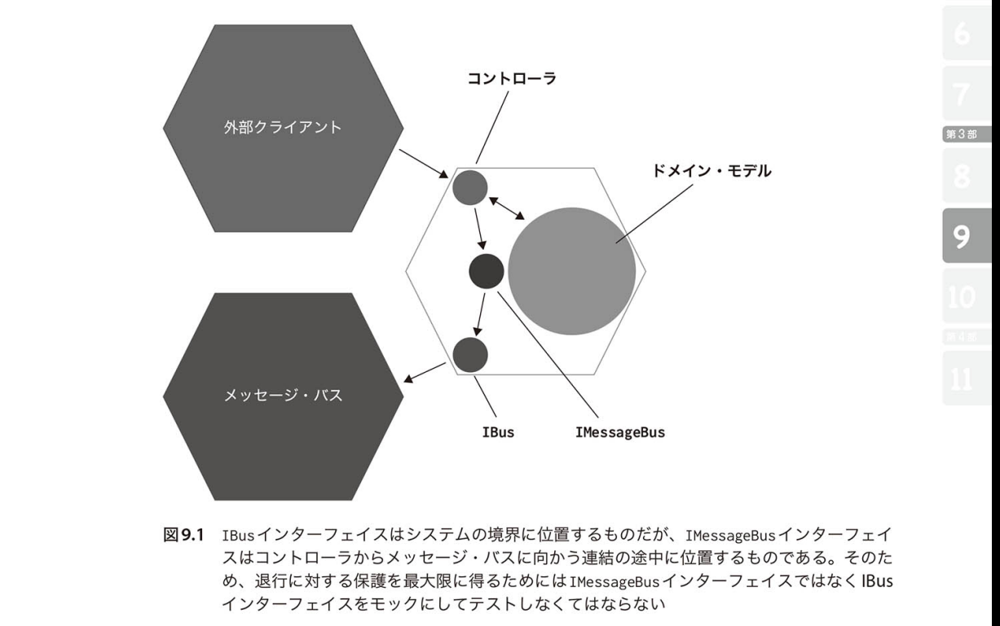

# モックのベストプラクティス(統合テスト)

## モックを活用するのはアプリケーションの境界を担うオブジェクト

退行に対する保護を最大限得られるのは、下記の図で*IBus*インターフェースをモック化したとき 
理由としては、**検証は最終的な結果のみにすべきであるから** 
*IMessageBus*インターフェースを検証することは、実装の詳細の検証でありリファクタリングへの耐性が損なわれる原因になる

## モックを使用は統合テストに限定すべき
連携を指揮するコードのテストでのみモックを使用すべきである
  - e.g.) Controller

## 一つのテストケースで複数のモックを扱うのは良い？
### 結論: 問題なし
１つのテストケースで検証すべきことは**1単位の振る舞い**である 
上記を満たす限り、モックの数が複数になることは問題なし

## モックの呼び出し回数も検証すべき
モックの**呼び出しの内容**を検証するだけでは不十分 
**適切な回数**呼び出されていることも確認すべき
  - 必要なメソッドが必要な回数呼び出されていること
  - 不必要なメソッドが呼び出されていないこと

## モックの作成は自身のプロジェクトが所有する型に限定するべき

**管理下にない依存**にサードパーティ製ライブラリなどを使用している場合、これらの依存をラップするインターフェースを用意しそれをモックに置き換えるべきである

> [!WARNING] 同じプロセス内の管理下にある依存に対しては例外
日時を扱うAPIやO/Rマッパーなど、管理下にある依存に対してそれらをラップするインターフェースは用意すべきではない。それに見合う価値がないため。